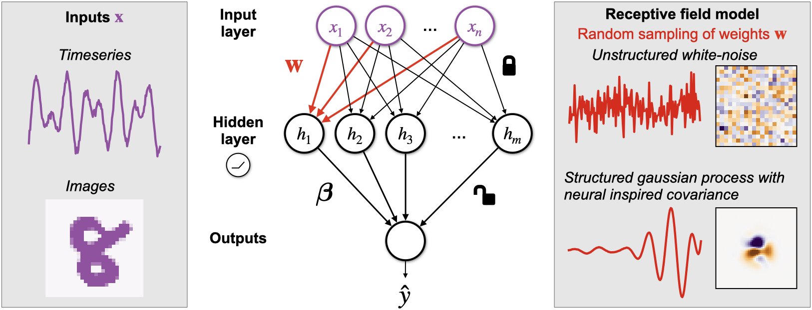

Structured random receptive fields
==============================

This code generates the analyses in the paper "Structured random receptive fields enable informative sensory encodings".
https://www.biorxiv.org/content/10.1101/2021.09.09.459651v2.full

__Summary__: In this work, we describe an approach to model receptive fields
of biological neurons as samples from Gaussian Processes (GP).
We successfully model receptive fields datasets in two disparate 
sensory regions, insect mechanosensors and mammalian primary visual cortex (V1).
Using our models, we also show a novel initialization scheme that improves
the learning efficiency of artificial neural networks (ANNs).

Steps to set up the directory:
------------

1. Do a clean download of the repository. Go inside the repo.
        cd \path\to\random_features\
        
2. Make a virtual Conda environment. We will be using python version 3.8.
	conda create --name random_features python=3.8
	
3. Activate the new conda environment
	conda activate random_features
	
4.  Run the make file to download all the datasets and preprocess.
         make data
         
5.  Run the notebooks in notebooks/reports folder.  

Remark: Always work in the newly created conda environment. Please read the 
cookiecutter docs for best practices. 

Replicating our published findings
------------
- The source code is in the /src folder. The notebooks/reports contain the 
analyses used in the paper. 

- Notebooks 1-5 show how we fit our covariance models to biological data. 

- Notebooks 6 and 7 show the time-series classification tasks.

- Notebooks 9, 11, 12 and 13 show the digit classification tasks. The _estimator
tag means we classify using an sklearn SVM. The _torch tag means we solve by
using gradient descent on the SVM loss.  In the paper, we show results from
the _estimator notebooks.

- Notebooks 15-16 show our results from initializing networks using structured
random features.

- Notebooks 10.xx are used to plot the figures shown in the paper. However, they
do assume you have run the rest of the notebooks and saved them in models/results
folder. 

Project Organization
------------

    ├── LICENSE
    ├── Makefile           <- Makefile with commands like `make data` or `make train`
    ├── README.md          <- The top-level README for developers using this project.
    ├── data
    │   ├── external       <- Data from third party sources.
    │   ├── interim        <- Intermediate data that has been transformed.
    │   ├── processed      <- The final, canonical data sets for modeling.
    │   └── raw            <- The original, immutable data dump.
    │
    ├── docs               <- A default Sphinx project; see sphinx-doc.org for details
    │
    ├── models             <- Results from trained models
    │
    ├── notebooks          <- Jupyter notebooks.
    │   ├── exploratory    <- Used for exploratory purposes                          
    │   ├── reports        <- Final analyses                
    │
    ├── references         <- N/A
    │
    ├── reports            <- Generated analysis as HTML, PDF, LaTeX, etc.
    │   └── figures        <- Generated graphics and figures to be used in reporting
    │
    ├── requirements.txt   <- The requirements file for reproducing the analysis environment, e.g.
    │                         generated with `pip freeze > requirements.txt`
    │
    ├── setup.py           <- makes project pip installable (pip install -e .) so src can be imported
    ├── src                <- Source code for use in this project.
    │   ├── __init__.py    <- Makes src a Python module
    │   │
    │   ├── data           <- Scripts to download or generate data
    │   │   └── make_dataset.py
    │   │
    │   ├── models         <- Scripts to make and train models.
    │   │
    │   └── visualization  <- Scripts to create exploratory and results oriented visualizations
    │       └── visualize.py
    │
    └── tox.ini            <- tox file with settings for running tox; see tox.readthedocs.io

--------

<small>Project structure is based on the <a target="_blank" href="https://drivendata.github.io/cookiecutter-data-science/">cookiecutter data science project template</a>. #cookiecutterdatascience</small>
